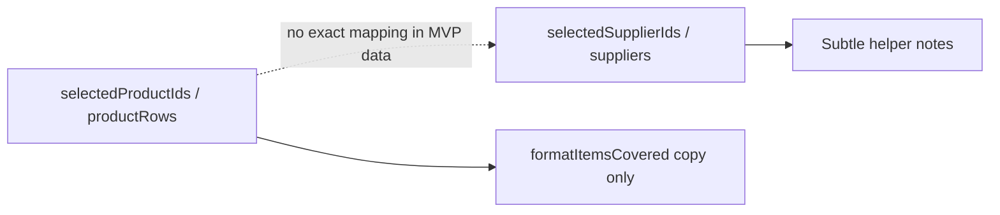

# Prompt 6: Supplier / Product Selection Sync

## Scope

**Single file:** [`components/recommendations/RecommendationsClient.tsx`](components/recommendations/RecommendationsClient.tsx)

**Add:** Supplier row checkboxes, `selectedSupplierIds` state, dynamic Items covered copy, Supplier Comparison header count + helper copy, supplier drawer selected label.

**Skip (no data):** Confirmation/add-supplier modals and auto product select/deselect — no `supplier-to-product` mapping exists in [`SupplierOption`](lib/schemas/ami.ts) or analysis output ([`buildSupplierOptions`](lib/ami/analysis.ts) has no product links).

---

## Data reality



Implement `hasExactSupplierProductMapping()` returning `false` (or `null` mapping) so sync modals and destructive/auto-select paths never run until a later prompt adds real mapping.

---

## 1. Supplier IDs and selection state

In [`ActiveTabContent`](components/recommendations/RecommendationsClient.tsx):

```tsx
const [selectedSupplierIds, setSelectedSupplierIds] = useState<Set<string>>(() => new Set());
```

Add helper:

```tsx
function getSupplierRowId(supplier: SupplierOption, index: number) {
  return `supplier-${index}-${supplier.supplierName}-${supplier.source}`;
}
```

Default: empty Set (no auto-select all on load).

Reuse existing [`toggleSelection`](components/recommendations/RecommendationsClient.tsx).

---

## 2. Update `formatItemsCovered` for selected vs full list

Replace current two-arg logic to accept **selected product count**:

```tsx
function formatItemsCovered(totalProductCandidates: number, selectedProductCandidates: number) {
  if (totalProductCandidates <= 0) return "Coverage not available";

  if (selectedProductCandidates > 0) {
    const noun = selectedProductCandidates === 1 ? "selected product" : "selected products";
    return `${selectedProductCandidates} of ${selectedProductCandidates} ${noun}`;
  }

  const noun = totalProductCandidates === 1 ? "product candidate" : "product candidates";
  return `${totalProductCandidates} of ${totalProductCandidates} ${noun}`;
}
```

| Products selected | Example |
|-------------------|---------|
| 0 of 2 total | `2 of 2 product candidates` |
| 1 selected | `1 of 1 selected product` |
| 2 selected | `2 of 2 selected products` |

Pass to table: `formatItemsCovered(productRows.length, selectedProductIds.size)`.

Remove generic column copy (`Connected to current analysis`, `Analysis-level coverage`).

Optional `coveredCount` per-supplier param: only use when exact mapping exists later; omit for now.

---

## 3. Refactor `SupplierComparisonTable`

**New first column:** checkbox (mirror [`PreviewRow`](components/recommendations/RecommendationsClient.tsx) checkbox styling).

**Row layout:** `[checkbox]` in supplier name cell (or dedicated narrow column) | Source | Items covered | Delivery batch | Risk | See details

**Props extension:**

```tsx
SupplierComparisonTable({
  suppliers,
  productCandidateCount,
  selectedProductCount,
  selectedSupplierIds,
  onToggleSupplier,
  onSeeDetails,
  getItemsCoveredForRow?: (supplier) => string  // optional; default shared formatItemsCovered
})
```

Per-row Items covered: same analysis-level string for all rows (current MVP); use shared `itemsCovered` computed once from counts.

**Checkbox:** `onChange` only — do not tie to row click; `See details` uses `stopPropagation` (already pattern from PreviewRow).

---

## 4. Supplier Comparison tab UI

**Header row** (flex, like selectable tabs):

```text
TabHeader (left)     |  N suppliers selected (right)
```

**Description:**

`Compare supplier options connected to this analysis and select suppliers to prepare Partner's Choice coverage.`

**Contextual helper** (below description, one at a time):

| Condition | Copy |
|-----------|------|
| `selectedProductIds.size === 0` | `Select product candidates to preview selected-product supplier coverage.` |
| `selectedProductIds.size > 0` | `Supplier coverage is currently scoped to selected product candidates.` |
| `selectedSupplierIds.size > 0 && selectedProductIds.size === 0` | `Supplier selected. Select product candidates manually to prepare Partner's Choice coverage.` |

Keep helpers subtle (`text-sm text-slate-600`).

Wire table:

```tsx
<SupplierComparisonTable
  suppliers={suppliers}
  productCandidateCount={productRows.length}
  selectedProductCount={selectedProductIds.size}
  selectedSupplierIds={selectedSupplierIds}
  onToggleSupplier={(id, checked) => toggleSelection(setSelectedSupplierIds, id, checked)}
  onSeeDetails={...}
/>
```

---

## 5. Supplier drawer — selected status

Extend [`SupplierDetailDrawer`](components/recommendations/RecommendationsClient.tsx):

```tsx
<SupplierDetailDrawer
  detail={supplierDrawer}
  isSelected={selectedSupplierIds.has(supplierDrawer.supplierId)}
  onClose={...}
/>
```

Store `supplierId` on `SupplierDrawerDetail` when opening (from `getSupplierRowId` at open time) so drawer can reflect selection after toggle.

Add under title in header (match item drawer):

```text
Selected | Not selected
```

**No** drawer checkbox in this prompt (spec allows skip if complex).

---

## 6. Sync behavior (explicit non-implementation)

| Flow | MVP behavior (no mapping) |
|------|---------------------------|
| A — Product selection | Updates Items covered + helper copy only; all suppliers remain visible |
| B — Select supplier | No auto-select products; show manual-selection helper when supplier selected and no products selected |
| C — Deselect supplier | Toggle off only; no product removal; **no modal** |
| Select supplier warning | **Not shown**; no auto-add products |

Add small internal comment + `hasExactSupplierProductMapping = false` guard so future mapping can enable modals without rewriting handlers.

**Do not** filter supplier list by selected products.

---

## 7. Modals (deferred infrastructure)

Do **not** add modal components in this prompt unless mapping hook returns data — avoids dead UI and false warnings per acceptance criteria.

Document extension point:

```tsx
// When supplierProductMap is available, wire:
// - deselect confirmation
// - add-supplier confirmation
// - session "don't show again" flags (useState in ActiveTabContent)
```

---

## 8. Preserve unchanged

- Product/Promo/Inventory tabs, pagination, item drawers
- Evidence tab
- No export bar, no schema/API edits
- [`toggleSelection`](components/recommendations/RecommendationsClient.tsx) pattern for products unchanged

---

## Acceptance mapping

| # | How |
|---|-----|
| 1–3 | Supplier checkboxes + local state + header count |
| 4 | Drawer Selected/Not selected |
| 5–8 | Product/promo/inventory selection + drawers intact |
| 9–10 | Items covered reflects selected vs full counts |
| 11 | No fake mappings |
| 12–13 | No auto product changes without mapping |
| 14–20 | No export/backend; Evidence unchanged |

---

## Assumptions

- Selected-product coverage displays `N of N selected products` (analysis-level: each supplier “covers” the full selected set), not `1 of 2 selected products` when one of two is selected — aligns with spec examples.
- `supplierId` stored on drawer open uses index+name+source for stability.

## Deferred

- Exact mapping, modals, drawer supplier toggle, export bar, Partner’s Choice persistence.

## Risks

- Opening supplier drawer before/after toggle must pass current `isSelected` from `selectedSupplierIds` (re-render on toggle while drawer open updates label).
