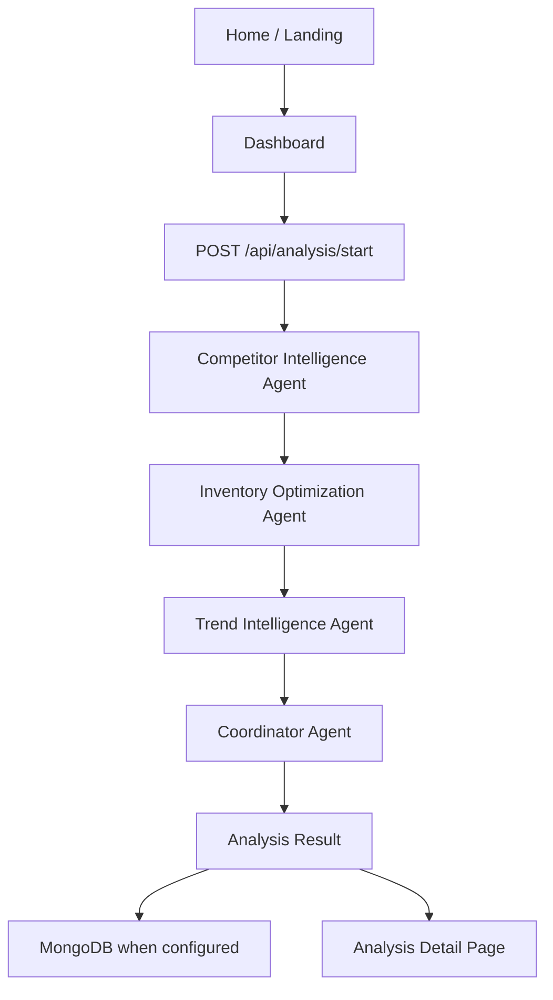

# Architecture

## Monolithic Next.js App

The MVP is a single Next.js App Router project. Pages, components, API routes, agent logic, integration wrappers, schemas, and MongoDB models live in one deployable codebase. This keeps the hackathon surface area small and makes Vercel deployment straightforward.

## Shared Intelligence Layer

MongoDB is the shared intelligence layer when `MONGODB_URI` is configured. It stores:

- Users
- Marketplace projects
- Analysis runs
- Agent outputs
- Coordinator recommendations

If MongoDB is unavailable, the app uses an in-memory fallback store and browser local storage for the immediate demo flow.

## Agent Orchestration

The orchestration is intentionally simple:

1. Create an analysis run.
2. Run Competitor Intelligence.
3. Run Inventory Optimization.
4. Run Trend Intelligence.
5. Run Coordinator.
6. Store outputs and recommendations when MongoDB is available.
7. Return a complete JSON result to the UI.

The agents are deterministic today, but their contracts are structured for future AI-generated outputs.

## Integration Boundaries

Bright Data calls are isolated in `lib/brightdata/client.ts`. OpenAI calls are isolated in `lib/openai/client.ts`. Agent modules consume wrappers, not raw vendor SDK calls, which keeps demo fallback behavior centralized.
